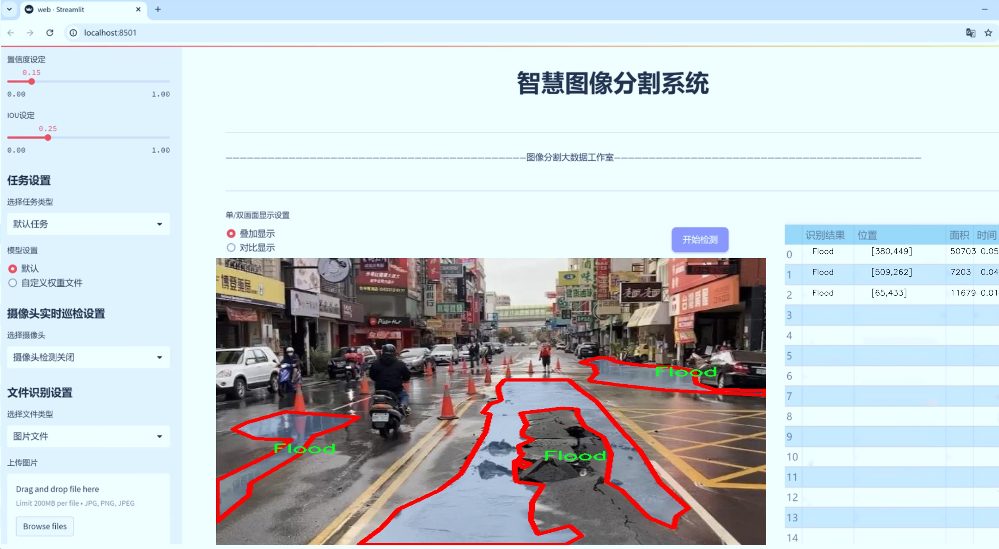
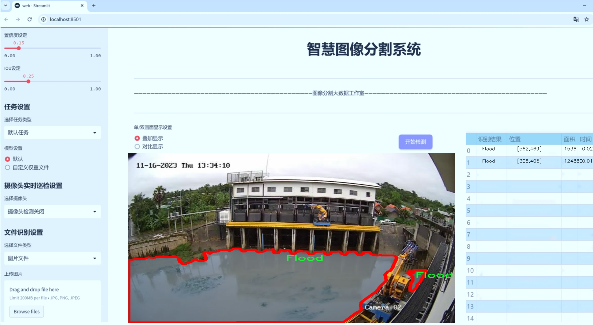
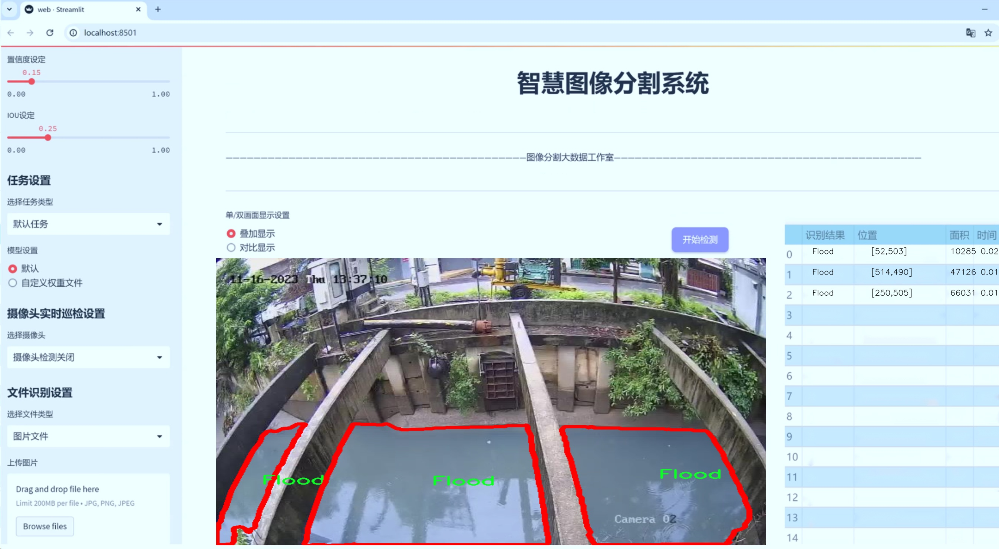
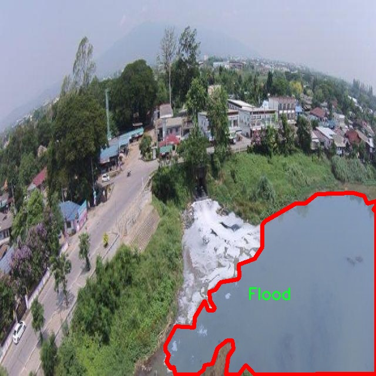
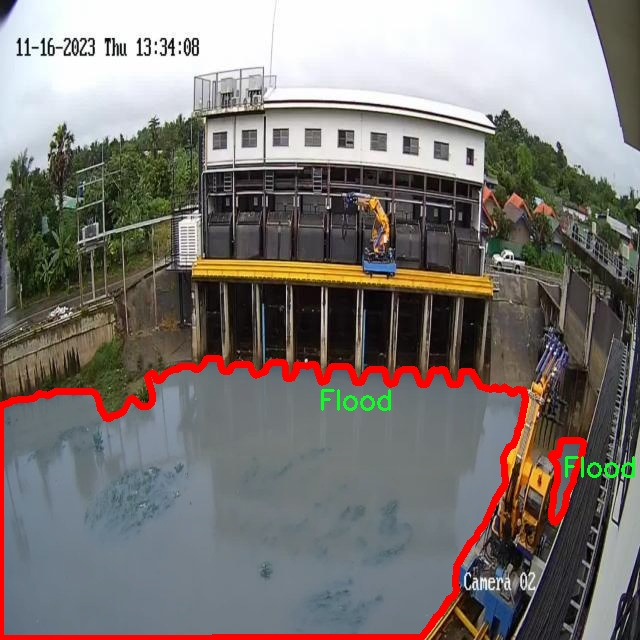
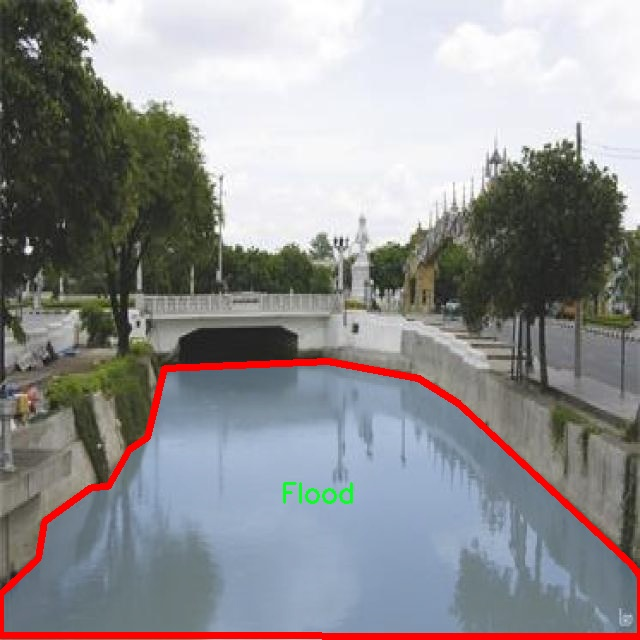
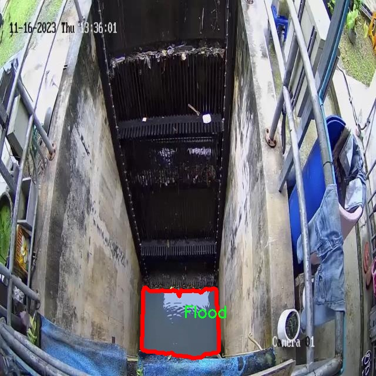
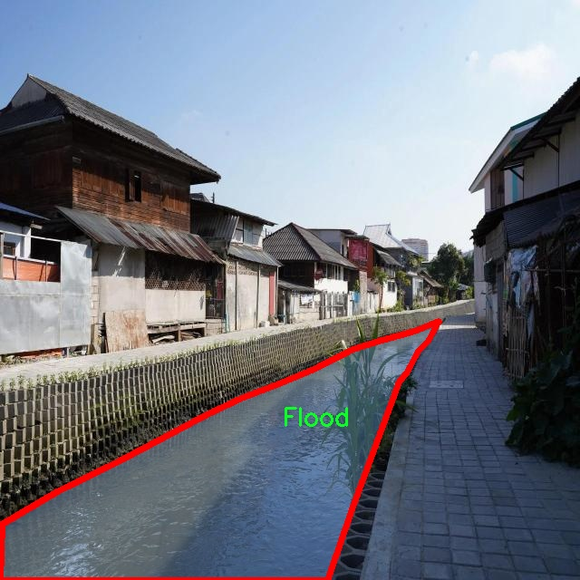

# 大坝水位识别水域图像分割系统源码＆数据集分享
 [yolov8-seg-C2f-SCcConv＆yolov8-seg-p2等50+全套改进创新点发刊_一键训练教程_Web前端展示]

### 1.研究背景与意义

项目参考[ILSVRC ImageNet Large Scale Visual Recognition Challenge](https://gitee.com/YOLOv8_YOLOv11_Segmentation_Studio/projects)

项目来源[AAAI Global Al lnnovation Contest](https://kdocs.cn/l/cszuIiCKVNis)

研究背景与意义

随着全球气候变化的加剧，极端天气事件的频发使得水灾等自然灾害的发生率显著上升。尤其是在一些地势低洼、河流密集的地区，洪水带来的威胁不仅对生态环境造成了严重影响，也对人类的生命财产安全构成了巨大挑战。因此，及时、准确地监测和评估水位变化，成为了防洪减灾工作中的一项重要任务。传统的水位监测方法多依赖于人工观测和传统水位计，这不仅效率低下，而且在大范围区域内的应用受到限制。为此，基于计算机视觉和深度学习技术的自动化水位监测系统逐渐受到关注。

在这一背景下，YOLO（You Only Look Once）系列目标检测算法因其高效性和实时性，成为了水域图像分析的重要工具。YOLOv8作为该系列的最新版本，进一步提升了检测精度和速度，尤其在复杂场景下的表现更为出色。然而，针对大坝水位的具体应用，现有的YOLOv8模型仍存在一定的局限性，尤其是在水域图像的分割和识别方面。因此，基于改进YOLOv8的大坝水位识别水域图像分割系统的研究显得尤为重要。

本研究将利用“FLOOD SEPTEMBER 25 DATASET”这一数据集进行模型训练和评估。该数据集包含5000幅图像，专注于洪水场景的实例分割，且类别数量为1，主要针对洪水的识别。这一数据集的选择为本研究提供了丰富的训练样本，能够有效支持模型在不同水位条件下的识别与分割能力的提升。通过对水域图像的深度学习分析，研究旨在实现对大坝水位的实时监测与预警，进而为防洪决策提供科学依据。

此外，改进YOLOv8的应用不仅限于水位监测，还可以扩展到其他与水域相关的环境监测任务，如水质分析、生态监测等。通过建立一个高效的水域图像分割系统，可以为相关领域的研究提供技术支持，推动智能监测技术的发展。尤其是在面对日益严峻的气候变化挑战时，快速、准确的水位监测系统将为政府和相关机构提供重要的决策依据，帮助他们制定更为有效的防洪措施，减少自然灾害带来的损失。

综上所述，基于改进YOLOv8的大坝水位识别水域图像分割系统的研究，不仅具有重要的理论意义，也具有广泛的实际应用价值。通过这一研究，我们期望能够为水灾防控提供新的思路和方法，推动智能监测技术在水域管理中的应用，进而为实现可持续发展目标贡献力量。

### 2.图片演示







##### 注意：由于此博客编辑较早，上面“2.图片演示”和“3.视频演示”展示的系统图片或者视频可能为老版本，新版本在老版本的基础上升级如下：（实际效果以升级的新版本为准）

  （1）适配了YOLOV8的“目标检测”模型和“实例分割”模型，通过加载相应的权重（.pt）文件即可自适应加载模型。

  （2）支持“图片识别”、“视频识别”、“摄像头实时识别”三种识别模式。

  （3）支持“图片识别”、“视频识别”、“摄像头实时识别”三种识别结果保存导出，解决手动导出（容易卡顿出现爆内存）存在的问题，识别完自动保存结果并导出到tempDir中。

  （4）支持Web前端系统中的标题、背景图等自定义修改，后面提供修改教程。

  另外本项目提供训练的数据集和训练教程,暂不提供权重文件（best.pt）,需要您按照教程进行训练后实现图片演示和Web前端界面演示的效果。

### 3.视频演示

[3.1 视频演示](https://www.bilibili.com/video/BV15P1VYmER2/)

### 4.数据集信息展示

##### 4.1 本项目数据集详细数据（类别数＆类别名）

nc: 1
names: ['Flood']


##### 4.2 本项目数据集信息介绍

数据集信息展示

在本研究中，我们采用了名为“FLOOD SEPTEMBER 25 DATASET”的数据集，以支持改进YOLOv8-seg的大坝水位识别水域图像分割系统的训练和评估。该数据集专注于洪水情境下的水域图像，具有重要的应用价值，尤其是在自然灾害管理和水资源监测等领域。数据集的构建旨在为机器学习模型提供丰富的样本，以提高其在复杂环境下的识别和分割能力。

“FLOOD SEPTEMBER 25 DATASET”包含了多种场景下的水域图像，所有图像均经过精心挑选，确保涵盖不同的光照条件、天气状况以及水位变化等因素。这些因素的多样性使得数据集在训练过程中能够有效地提高模型的泛化能力，从而使其在实际应用中表现得更加稳健。数据集中包含的类别数量为1，具体类别为“Flood”，这一单一类别的选择反映了研究的专注性，旨在深入探讨洪水对水域的影响及其识别方法。

在数据集的构建过程中，研究团队对图像进行了详细的标注，确保每张图像中洪水区域的准确定位。这一过程不仅提高了数据集的质量，也为后续的模型训练提供了可靠的基础。通过高质量的标注，YOLOv8-seg模型能够学习到洪水区域的特征，从而在新图像中实现准确的分割和识别。

此外，数据集还考虑到了不同类型的水域环境，包括河流、湖泊和水库等，这些环境在洪水发生时表现出不同的特征和动态变化。通过对这些不同水域的图像进行分析，模型能够学习到更加全面的特征，进而提高其在各种水域条件下的适应能力。这种多样性不仅增强了模型的鲁棒性，也为未来可能的扩展和应用提供了广阔的空间。

在训练过程中，研究团队将“FLOOD SEPTEMBER 25 DATASET”与YOLOv8-seg模型的各项参数进行优化，以实现最佳的图像分割效果。模型的训练不仅依赖于数据集的丰富性和多样性，还需要通过反复的迭代和调整，确保模型能够在实际应用中快速、准确地识别洪水区域。数据集的使用使得模型在面对真实世界的复杂情况时，能够保持高效的识别能力。

综上所述，“FLOOD SEPTEMBER 25 DATASET”作为本研究的核心数据来源，为改进YOLOv8-seg的大坝水位识别水域图像分割系统提供了坚实的基础。通过对洪水这一特定类别的深入研究，数据集不仅为模型的训练提供了丰富的样本，也为后续的研究和应用奠定了重要的理论基础。随着研究的深入，期望能够在洪水监测和管理中发挥更大的作用，为相关领域的科学研究和实际应用提供有力支持。











### 5.全套项目环境部署视频教程（零基础手把手教学）

[5.1 环境部署教程链接（零基础手把手教学）](https://www.bilibili.com/video/BV1jG4Ve4E9t/?vd_source=bc9aec86d164b67a7004b996143742dc)


[5.2 安装Python虚拟环境创建和依赖库安装视频教程链接（零基础手把手教学）](https://www.bilibili.com/video/BV1nA4VeYEze/?vd_source=bc9aec86d164b67a7004b996143742dc)

### 6.手把手YOLOV8-seg训练视频教程（零基础小白有手就能学会）

[6.1 手把手YOLOV8-seg训练视频教程（零基础小白有手就能学会）](https://www.bilibili.com/video/BV1cA4VeYETe/?vd_source=bc9aec86d164b67a7004b996143742dc)


按照上面的训练视频教程链接加载项目提供的数据集，运行train.py即可开始训练



     Epoch   gpu_mem       box       obj       cls    labels  img_size
     1/200     0G   0.01576   0.01955  0.007536        22      1280: 100%|██████████| 849/849 [14:42<00:00,  1.04s/it]
               Class     Images     Labels          P          R     mAP@.5 mAP@.5:.95: 100%|██████████| 213/213 [01:14<00:00,  2.87it/s]
                 all       3395      17314      0.994      0.957      0.0957      0.0843

     Epoch   gpu_mem       box       obj       cls    labels  img_size
     2/200     0G   0.01578   0.01923  0.007006        22      1280: 100%|██████████| 849/849 [14:44<00:00,  1.04s/it]
               Class     Images     Labels          P          R     mAP@.5 mAP@.5:.95: 100%|██████████| 213/213 [01:12<00:00,  2.95it/s]
                 all       3395      17314      0.996      0.956      0.0957      0.0845

     Epoch   gpu_mem       box       obj       cls    labels  img_size
     3/200     0G   0.01561    0.0191  0.006895        27      1280: 100%|██████████| 849/849 [10:56<00:00,  1.29it/s]
               Class     Images     Labels          P          R     mAP@.5 mAP@.5:.95: 100%|███████   | 187/213 [00:52<00:00,  4.04it/s]
                 all       3395      17314      0.996      0.957      0.0957      0.0845


### 7.50+种全套YOLOV8-seg创新点代码加载调参视频教程（一键加载写好的改进模型的配置文件）

[7.1 50+种全套YOLOV8-seg创新点代码加载调参视频教程（一键加载写好的改进模型的配置文件）](https://www.bilibili.com/video/BV1Hw4VePEXv/?vd_source=bc9aec86d164b67a7004b996143742dc)

### 8.YOLOV8-seg图像分割算法原理

原始YOLOv8-seg算法原理

YOLOv8-seg算法是YOLO系列中最新的一个重要版本，专注于目标检测与实例分割任务。该算法的设计不仅继承了YOLO系列的优良传统，还在此基础上进行了多项创新和改进，使其在精度和效率上均有显著提升。YOLOv8-seg模型的核心思想是通过精简和优化网络结构，以提高模型的推理速度和准确性，同时兼顾小目标检测和高分辨率图像处理的需求。

YOLOv8-seg的网络结构可以分为三个主要部分：输入端、主干网络和检测头。输入端负责接收图像数据，并进行必要的预处理。主干网络则是模型的核心，负责特征提取。YOLOv8采用了改进的C2f模块来替代传统的C3模块，C2f模块引入了更多的跳层连接和残差结构，这不仅增强了梯度流动，还提高了特征提取的丰富性和准确性。通过这样的设计，YOLOv8能够在保持轻量化的同时，获得更为全面的特征信息，从而提升了模型的整体性能。

在主干网络的设计中，YOLOv8继续使用PAN-FPN结构，尽管上采样部分的卷积结构被删除，这一改动有效减少了计算量，同时保留了特征融合的优势。通过对比实验，研究者发现这种结构在目标检测任务中表现出色，尤其是在复杂场景下，能够有效提高目标的识别率。

YOLOv8-seg在检测头部分进行了重要的创新，采用了解耦合头结构。这一结构将分类和定位任务分开处理，使得模型在进行目标分类时，可以更专注于特征图中的类别信息，而在进行边界框回归时，则更加关注于框与真实目标之间的空间关系。这种分离的策略不仅提高了模型的收敛速度，还增强了预测的精度。此外，YOLOv8-seg采用了无锚框（Anchor-Free）的方法，直接预测目标的中心点，这一设计简化了模型的复杂性，并在多个实验中显示出更优的性能。

在训练过程中，YOLOv8-seg引入了动态任务对齐学习（Task Alignment Learning, TAL）策略，通过引入分类分数和IOU的高次幂乘积作为衡量任务对齐程度的指标，使得模型在分类和定位任务中能够实现更好的协调。与此同时，YOLOv8-seg在损失函数的设计上也进行了创新，采用了BCELoss作为分类损失，并结合DFLLoss和CIoULoss作为回归损失，这种多损失函数的组合进一步提升了模型的训练效果。

为了提高模型的鲁棒性，YOLOv8-seg在数据增强方面也进行了调整。尽管Mosaic数据增强技术在一定程度上提升了模型的泛化能力，但YOLOv8-seg在训练的最后10个epoch中停止使用这一增强方法，以避免对数据真实分布的破坏。这样的设计使得模型在训练后期能够更好地适应真实场景中的数据分布，提高了模型的实际应用效果。

在实际应用中，YOLOv8-seg模型展现出了优异的性能，尤其是在处理复杂背景和小目标时，能够有效地进行实例分割和目标检测。通过在COCO数据集上的实验，YOLOv8-seg在多个评估指标上均超过了之前的YOLO系列模型，显示出其在精度和速度上的优势。这一系列的改进和创新，使得YOLOv8-seg不仅适用于学术研究，也为工业界的实际应用提供了强有力的支持。

综上所述，YOLOv8-seg算法通过对网络结构的优化、检测头的解耦合设计、损失函数的创新以及数据增强策略的调整，形成了一种高效、准确的目标检测与实例分割解决方案。随着计算机视觉技术的不断发展，YOLOv8-seg无疑将在更多的应用场景中发挥重要作用，推动相关领域的进一步研究与发展。


### 9.系统功能展示（检测对象为举例，实际内容以本项目数据集为准）

图9.1.系统支持检测结果表格显示

  图9.2.系统支持置信度和IOU阈值手动调节

  图9.3.系统支持自定义加载权重文件best.pt(需要你通过步骤5中训练获得)

  图9.4.系统支持摄像头实时识别

  图9.5.系统支持图片识别

  图9.6.系统支持视频识别

  图9.7.系统支持识别结果文件自动保存

  图9.8.系统支持Excel导出检测结果数据


### 10.50+种全套YOLOV8-seg创新点原理讲解（非科班也可以轻松写刊发刊，V11版本正在科研待更新）

#### 10.1 由于篇幅限制，每个创新点的具体原理讲解就不一一展开，具体见下列网址中的创新点对应子项目的技术原理博客网址【Blog】：


[10.1 50+种全套YOLOV8-seg创新点原理讲解链接](https://gitee.com/qunmasj/good)

#### 10.2 部分改进模块原理讲解(完整的改进原理见上图和技术博客链接)【如果此小节的图加载失败可以通过CSDN或者Github搜索该博客的标题访问原始博客，原始博客图片显示正常】
### YOLOv8简介
#### Neck模块设计
骨干网络和 Neck 的具体变化为：

第一个卷积层的 kernel 从 6x6 变成了 3x3
所有的 C3 模块换成 C2f，结构如下所示，可以发现多了更多的跳层连接和额外的 Split 操作


去掉了 Neck 模块中的 2 个卷积连接层
Backbone 中 C2f 的 block 数从 3-6-9-3 改成了 3-6-6-3
查看 N/S/M/L/X 等不同大小模型，可以发现 N/S 和 L/X 两组模型只是改了缩放系数，但是 S/M/L 等骨干网络的通道数设置不一样，没有遵循同一套缩放系数。如此设计的原因应该是同一套缩放系数下的通道设置不是最优设计，YOLOv7 网络设计时也没有遵循一套缩放系数作用于所有模型。

#### Head模块设计
Head 部分变化最大，从原先的耦合头变成了解耦头，并且从 YOLOv5 的 Anchor-Based 变成了 Anchor-Free。其结构如下所示：


可以看出，不再有之前的 objectness 分支，只有解耦的分类和回归分支，并且其回归分支使用了 Distribution Focal Loss 中提出的积分形式表示法。

#### Loss 计算
Loss 计算过程包括 2 个部分： 正负样本分配策略和 Loss 计算。 现代目标检测器大部分都会在正负样本分配策略上面做文章，典型的如 YOLOX 的 simOTA、TOOD 的 TaskAlignedAssigner 和 RTMDet 的 DynamicSoftLabelAssigner，这类 Assigner 大都是动态分配策略，而 YOLOv5 采用的依然是静态分配策略。考虑到动态分配策略的优异性，YOLOv8 算法中则直接引用了 TOOD 的 TaskAlignedAssigner。 TaskAlignedAssigner 的匹配策略简单总结为： 根据分类与回归的分数加权的分数选择正样本。

s 是标注类别对应的预测分值，u 是预测框和 gt 框的 iou，两者相乘就可以衡量对齐程度。

对于每一个 GT，对所有的预测框基于 GT 类别对应分类分数，预测框与 GT 的 IoU 的加权得到一个关联分类以及回归的对齐分数 alignment_metrics 。
对于每一个 GT，直接基于 alignment_metrics 对齐分数选取 topK 大的作为正样本
Loss 计算包括 2 个分支： 分类和回归分支，没有了之前的 objectness 分支。
分类分支依然采用 BCE Loss
回归分支需要和 Distribution Focal Loss 中提出的积分形式表示法绑定，因此使用了 Distribution Focal Loss， 同时还使用了 CIoU Loss
Loss 采用一定权重比例加权即可。
#### 训练数据增强
数据增强方面和 YOLOv5 差距不大，只不过引入了 YOLOX 中提出的最后 10 个 epoch 关闭 Mosaic 的操作。假设训练 epoch 是 500，其示意图如下所示：

### RCS-OSA的基本原理
参考该博客，RCSOSA（RCS-One-Shot Aggregation）是RCS-YOLO中提出的一种结构，我们可以将主要原理概括如下：

1. RCS（Reparameterized Convolution based on channel Shuffle）: 结合了通道混洗，通过重参数化卷积来增强网络的特征提取能力。

2. RCS模块: 在训练阶段，利用多分支结构学习丰富的特征表示；在推理阶段，通过结构化重参数化简化为单一分支，减少内存消耗。

3. OSA（One-Shot Aggregation）: 一次性聚合多个特征级联，减少网络计算负担，提高计算效率。

4. 特征级联: RCS-OSA模块通过堆叠RCS，确保特征的复用并加强不同层之间的信息流动。

#### RCS
RCS（基于通道Shuffle的重参数化卷积）是RCS-YOLO的核心组成部分，旨在训练阶段通过多分支结构学习丰富的特征信息，并在推理阶段通过简化为单分支结构来减少内存消耗，实现快速推理。此外，RCS利用通道分割和通道Shuffle操作来降低计算复杂性，同时保持通道间的信息交换，这样在推理阶段相比普通的3×3卷积可以减少一半的计算复杂度。通过结构重参数化，RCS能够在训练阶段从输入特征中学习深层表示，并在推理阶段实现快速推理，同时减少内存消耗。

#### RCS模块
RCS（基于通道Shuffle的重参数化卷积）模块中，结构在训练阶段使用多个分支，包括1x1和3x3的卷积，以及一个直接的连接（Identity），用于学习丰富的特征表示。在推理阶段，结构被重参数化成一个单一的3x3卷积，以减少计算复杂性和内存消耗，同时保持训练阶段学到的特征表达能力。这与RCS的设计理念紧密相连，即在不牺牲性能的情况下提高计算效率。


上图为大家展示了RCS的结构，分为训练阶段（a部分）和推理阶段（b部分）。在训练阶段，输入通过通道分割，一部分输入经过RepVGG块，另一部分保持不变。然后通过1x1卷积和3x3卷积处理RepVGG块的输出，与另一部分输入进行通道Shuffle和连接。在推理阶段，原来的多分支结构被简化为一个单一的3x3 RepConv块。这种设计允许在训练时学习复杂特征，在推理时减少计算复杂度。黑色边框的矩形代表特定的模块操作，渐变色的矩形代表张量的特定特征，矩形的宽度代表张量的通道数。 

#### OSA
OSA（One-Shot Aggregation）是一个关键的模块，旨在提高网络在处理密集连接时的效率。OSA模块通过表示具有多个感受野的多样化特征，并在最后的特征映射中仅聚合一次所有特征，从而克服了DenseNet中密集连接的低效率问题。

OSA模块的使用有两个主要目的：

1. 提高特征表示的多样性：OSA通过聚合具有不同感受野的特征来增加网络对于不同尺度的敏感性，这有助于提升模型对不同大小目标的检测能力。

2. 提高效率：通过在网络的最后一部分只进行一次特征聚合，OSA减少了重复的特征计算和存储需求，从而提高了网络的计算和能源效率。

在RCS-YOLO中，OSA模块被进一步与RCS（基于通道Shuffle的重参数化卷积）相结合，形成RCS-OSA模块。这种结合不仅保持了低成本的内存消耗，而且还实现了语义信息的有效提取，对于构建轻量级和大规模的对象检测器尤为重要。

下面我将为大家展示RCS-OSA（One-Shot Aggregation of RCS）的结构。


在RCS-OSA模块中，输入被分为两部分，一部分直接通过，另一部分通过堆叠的RCS模块进行处理。处理后的特征和直接通过的特征在通道混洗（Channel Shuffle）后合并。这种结构设计用于增强模型的特征提取和利用效率，是RCS-YOLO架构中的一个关键组成部分旨在通过一次性聚合来提高模型处理特征的能力，同时保持计算效率。

#### 特征级联
特征级联（feature cascade）是一种技术，通过在网络的一次性聚合（one-shot aggregate）路径上维持有限数量的特征级联来实现的。在RCS-YOLO中，特别是在RCS-OSA（RCS-Based One-Shot Aggregation）模块中，只保留了三个特征级联。

特征级联的目的是为了减轻网络计算负担并降低内存占用。这种方法可以有效地聚合不同层次的特征，提高模型的语义信息提取能力，同时避免了过度复杂化网络结构所带来的低效率和高资源消耗。

下面为大家提供的图像展示的是RCS-YOLO的整体架构，其中包括RCS-OSA模块。RCS-OSA在模型中用于堆叠RCS模块，以确保特征的复用并加强不同层之间的信息流动。图中显示的多层RCS-OSA模块的排列和组合反映了它们如何一起工作以优化特征传递和提高检测性能。


总结：RCS-YOLO主要由RCS-OSA（蓝色模块）和RepVGG（橙色模块）构成。这里的n代表堆叠RCS模块的数量。n_cls代表检测到的对象中的类别数量。图中的IDetect是从YOLOv7中借鉴过来的，表示使用二维卷积神经网络的检测层。这个架构通过堆叠的RCS模块和RepVGG模块，以及两种类型的检测层，实现了对象检测的任务。 


### 11.项目核心源码讲解（再也不用担心看不懂代码逻辑）

#### 11.1 ultralytics\nn\extra_modules\block.py

以下是对您提供的代码进行的核心部分提取和详细中文注释。由于代码较长，我将提取出一些关键的类和函数，并进行注释。

```python
import torch
import torch.nn as nn
import torch.nn.functional as F

def autopad(k, p=None, d=1):
    """自动填充以保持输出形状与输入相同。"""
    if d > 1:
        k = d * (k - 1) + 1 if isinstance(k, int) else [d * (x - 1) + 1 for x in k]  # 实际的卷积核大小
    if p is None:
        p = k // 2 if isinstance(k, int) else [x // 2 for x in k]  # 自动填充
    return p

class DyReLU(nn.Module):
    """动态ReLU激活函数，具有可学习的参数。"""
    def __init__(self, inp, reduction=4, lambda_a=1.0, use_bias=True):
        super(DyReLU, self).__init__()
        self.oup = inp
        self.lambda_a = lambda_a * 2
        self.avg_pool = nn.AdaptiveAvgPool2d(1)  # 自适应平均池化
        self.fc = nn.Sequential(
            nn.Linear(inp, inp // reduction),  # 压缩通道
            nn.ReLU(inplace=True),
            nn.Linear(inp // reduction, self.oup * 2),  # 输出两个参数
            nn.Sigmoid()  # 激活函数
        )

    def forward(self, x):
        """前向传播。"""
        b, c, h, w = x.size()
        y = self.avg_pool(x).view(b, c)  # 池化后展平
        y = self.fc(y).view(b, self.oup * 2, 1, 1)  # 通过全连接层
        a1, b1 = torch.split(y, self.oup, dim=1)  # 分割为两个参数
        a1 = (a1 - 0.5) * self.lambda_a + 1.0  # 学习的参数
        out = x * a1 + b1  # 应用动态ReLU
        return out

class DyHeadBlock(nn.Module):
    """动态头部块，结合多种注意力机制。"""
    def __init__(self, in_channels, norm_type='GN'):
        super().__init__()
        self.spatial_conv = nn.Conv2d(in_channels, in_channels, kernel_size=3, padding=1)  # 空间卷积
        self.offset_conv = nn.Conv2d(in_channels, 3 * 3 * 3, kernel_size=3, padding=1)  # 偏移卷积
        self.scale_attn_module = nn.Sequential(
            nn.AdaptiveAvgPool2d(1),
            nn.Conv2d(in_channels, 1, 1),
            nn.ReLU(inplace=True)
        )
        self.task_attn_module = DyReLU(in_channels)  # 动态ReLU

    def forward(self, x):
        """前向传播。"""
        offset_and_mask = self.offset_conv(x)  # 计算偏移和掩码
        mid_feat = self.spatial_conv(x)  # 中间特征
        scale_attn = self.scale_attn_module(mid_feat)  # 计算缩放注意力
        out = self.task_attn_module(mid_feat * scale_attn)  # 应用任务注意力
        return out

class Fusion(nn.Module):
    """融合模块，支持多种融合方式。"""
    def __init__(self, inc_list, fusion='bifpn'):
        super().__init__()
        self.fusion = fusion
        self.fusion_weight = nn.Parameter(torch.ones(len(inc_list), dtype=torch.float32), requires_grad=True)  # 融合权重

    def forward(self, x):
        """前向传播，执行融合操作。"""
        if self.fusion == 'bifpn':
            fusion_weight = F.relu(self.fusion_weight.clone())
            fusion_weight = fusion_weight / (torch.sum(fusion_weight, dim=0))  # 归一化权重
            return torch.sum(torch.stack([fusion_weight[i] * x[i] for i in range(len(x))], dim=0), dim=0)  # 融合特征
        # 其他融合方式可扩展
```

### 关键部分解释：
1. **`autopad`**: 自动计算填充以保持输入输出形状一致。
2. **`DyReLU`**: 动态ReLU激活函数，具有可学习的参数，通过自适应平均池化和全连接层生成两个参数，应用于输入特征。
3. **`DyHeadBlock`**: 结合多种注意力机制的动态头部块，计算偏移和掩码，并应用任务注意力。
4. **`Fusion`**: 融合模块，支持不同的融合方式（如`bifpn`），通过学习的权重对输入特征进行加权融合。

以上是对代码的核心部分提取和详细注释，若需要更深入的分析或特定模块的解释，请告知。

这个文件`ultralytics\nn\extra_modules\block.py`包含了多个深度学习模块的实现，主要用于构建神经网络的不同组件，特别是在计算机视觉任务中。以下是对文件中主要内容的逐步分析和说明。

首先，文件引入了一些必要的库，包括`torch`和`torch.nn`，这些是构建深度学习模型的基础库。接着，定义了一些常用的函数和类。

文件中定义了多个模块和层，主要包括以下几类：

1. **激活函数类**：如`swish`、`h_swish`和`h_sigmoid`，这些类实现了不同的激活函数，用于神经网络中的非线性变换。

2. **卷积模块**：如`DyDCNv2`和`DyHeadBlock`，这些模块实现了不同类型的卷积操作，包括可调节的卷积和带有注意力机制的卷积。`DyHeadBlock`是一个复杂的模块，结合了多种特征图的输入，计算偏移量和掩码，并通过动态卷积进行特征提取。

3. **融合模块**：如`Fusion`和`BiFusion`，这些模块用于将多个输入特征图进行融合，常用于特征金字塔网络（FPN）中，以提高特征的表达能力。

4. **注意力机制**：如`GSConv`、`SCConv`和`RFAConv`，这些模块实现了不同的注意力机制，通过加权特征图来增强模型对重要特征的关注。

5. **基础块和网络结构**：如`Bottleneck`、`C3`、`C2f`等，这些类实现了网络的基本构建块，通常用于构建更复杂的网络结构。`Bottleneck`通常用于残差网络中，通过跳跃连接来减轻梯度消失的问题。

6. **特定功能模块**：如`PyramidPoolAgg`和`Partial_conv3`，这些模块实现了特定的功能，如金字塔池化和部分卷积，通常用于提高模型的性能和效率。

7. **动态卷积和注意力机制**：如`DCNv2`和`DCNv3`，这些模块实现了动态卷积操作，能够根据输入特征动态调整卷积核，结合注意力机制，进一步增强特征提取能力。

文件的结构非常复杂，包含了许多不同的模块和功能，每个模块都有其特定的用途和实现方式。整体来看，这些模块的设计旨在提高深度学习模型在视觉任务中的表现，尤其是在特征提取和融合方面。

最后，文件还包含了一些辅助函数和工具类，用于支持上述模块的实现和功能扩展。通过这些模块的组合，可以构建出高效且强大的神经网络模型，适用于各种计算机视觉任务。

#### 11.2 ultralytics\models\rtdetr\val.py

以下是经过简化和注释的核心代码部分，主要包括 `RTDETRDataset` 和 `RTDETRValidator` 类的实现。注释详细解释了每个部分的功能和作用。

```python
# 导入必要的库
from pathlib import Path
import torch
from ultralytics.data import YOLODataset
from ultralytics.models.yolo.detect import DetectionValidator
from ultralytics.utils import ops

class RTDETRDataset(YOLODataset):
    """
    RT-DETR 数据集类，继承自 YOLODataset 类。
    该类专为 RT-DETR 目标检测模型设计，优化了实时检测和跟踪任务。
    """

    def __init__(self, *args, data=None, **kwargs):
        """初始化 RTDETRDataset 类，调用父类构造函数。"""
        super().__init__(*args, data=data, use_segments=False, use_keypoints=False, **kwargs)

    def load_image(self, i, rect_mode=False):
        """加载数据集中索引为 'i' 的一张图片，返回 (im, resized hw)。"""
        return super().load_image(i=i, rect_mode=rect_mode)

    def build_transforms(self, hyp=None):
        """构建数据预处理变换，仅用于评估阶段。"""
        transforms = []
        # 如果启用了增强，则构建相应的变换
        if self.augment:
            transforms = v8_transforms(self, self.imgsz, hyp, stretch=True)
        # 添加格式化变换
        transforms.append(
            ops.Format(bbox_format='xywh', normalize=True, return_mask=self.use_segments,
                       return_keypoint=self.use_keypoints, batch_idx=True,
                       mask_ratio=hyp.mask_ratio, mask_overlap=hyp.overlap_mask))
        return transforms


class RTDETRValidator(DetectionValidator):
    """
    RTDETRValidator 类扩展了 DetectionValidator 类，提供专门针对 RT-DETR 模型的验证功能。
    该类允许构建 RTDETR 特定的数据集进行验证，应用非极大值抑制进行后处理，并相应更新评估指标。
    """

    def build_dataset(self, img_path, mode='val', batch=None):
        """
        构建 RTDETR 数据集。

        参数:
            img_path (str): 包含图片的文件夹路径。
            mode (str): 模式，可以是 'train' 或 'val'，用户可以为每种模式自定义不同的增强。
            batch (int, optional): 批次大小，仅用于 'rect' 模式。默认为 None。
        """
        return RTDETRDataset(
            img_path=img_path,
            imgsz=self.args.imgsz,
            batch_size=batch,
            augment=False,  # 不进行增强
            hyp=self.args,
            rect=False,  # 不使用矩形模式
            cache=self.args.cache or None,
            prefix='{}: '.format(mode),
            data=self.data)

    def postprocess(self, preds):
        """对预测输出应用非极大值抑制。"""
        bs, _, nd = preds[0].shape  # bs: 批次大小, nd: 预测维度
        bboxes, scores = preds[0].split((4, nd - 4), dim=-1)  # 分离边界框和分数
        bboxes *= self.args.imgsz  # 将边界框缩放到原始图像大小
        outputs = [torch.zeros((0, 6), device=bboxes.device)] * bs  # 初始化输出
        for i, bbox in enumerate(bboxes):
            bbox = ops.xywh2xyxy(bbox)  # 转换边界框格式
            score, cls = scores[i].max(-1)  # 获取最大分数和对应类别
            pred = torch.cat([bbox, score[..., None], cls[..., None]], dim=-1)  # 合并边界框、分数和类别
            pred = pred[score.argsort(descending=True)]  # 按分数排序
            outputs[i] = pred  # 保存结果

        return outputs

    def update_metrics(self, preds, batch):
        """更新评估指标。"""
        for si, pred in enumerate(preds):
            idx = batch['batch_idx'] == si  # 获取当前批次的索引
            cls = batch['cls'][idx]  # 获取当前批次的类别
            bbox = batch['bboxes'][idx]  # 获取当前批次的边界框
            nl, npr = cls.shape[0], pred.shape[0]  # 标签数量和预测数量
            shape = batch['ori_shape'][si]  # 原始图像形状
            correct_bboxes = torch.zeros(npr, self.niou, dtype=torch.bool, device=self.device)  # 初始化正确边界框
            self.seen += 1  # 增加已处理的批次数

            if npr == 0:  # 如果没有预测
                if nl:
                    self.stats.append((correct_bboxes, *torch.zeros((2, 0), device=self.device), cls.squeeze(-1)))
                continue

            # 处理预测
            predn = pred.clone()  # 克隆预测
            predn[..., [0, 2]] *= shape[1] / self.args.imgsz  # 转换为原始空间
            predn[..., [1, 3]] *= shape[0] / self.args.imgsz  # 转换为原始空间

            # 评估
            if nl:
                tbox = ops.xywh2xyxy(bbox)  # 转换目标边界框格式
                tbox[..., [0, 2]] *= shape[1]  # 转换为原始空间
                tbox[..., [1, 3]] *= shape[0]  # 转换为原始空间
                labelsn = torch.cat((cls, tbox), 1)  # 合并标签和目标边界框
                correct_bboxes = self._process_batch(predn.float(), labelsn)  # 处理批次以获取正确边界框
            self.stats.append((correct_bboxes, pred[:, 4], pred[:, 5], cls.squeeze(-1)))  # 更新统计信息
```

### 代码核心部分说明
1. **RTDETRDataset 类**: 负责加载和处理 RT-DETR 数据集，继承自 YOLODataset，提供了图像加载和数据预处理功能。
2. **RTDETRValidator 类**: 负责验证 RT-DETR 模型的性能，构建数据集，处理预测结果，并更新评估指标。
3. **postprocess 方法**: 实现非极大值抑制，过滤掉低分数的预测框，确保只保留最有可能的检测结果。
4. **update_metrics 方法**: 更新模型的评估指标，计算正确的边界框并记录预测结果。

以上代码及注释提供了对 RT-DETR 数据集和验证器的核心功能的理解，适合用于目标检测任务的实现和评估。

这个程序文件是用于实现RT-DETR（实时目标检测与跟踪）模型的验证功能，继承自Ultralytics YOLO框架。文件中主要定义了两个类：`RTDETRDataset`和`RTDETRValidator`，它们分别用于数据集的构建和验证过程的管理。

`RTDETRDataset`类扩展了YOLODataset类，专门为RT-DETR模型设计，优化了实时检测和跟踪任务。构造函数中调用了父类的初始化方法，并设置了一些参数。该类重写了`load_image`方法，以加载特定索引的图像，并在`build_transforms`方法中定义了图像预处理的转换操作，包括数据增强和格式化处理。

`RTDETRValidator`类则扩展了DetectionValidator类，提供了专门针对RT-DETR模型的验证能力。它的`build_dataset`方法用于构建RTDETR数据集，接受图像路径、模式（训练或验证）和批量大小作为参数。`postprocess`方法实现了非极大值抑制（NMS），用于处理模型的预测输出，确保只保留最有可能的检测结果。`update_metrics`方法则负责更新评估指标，通过与真实标签进行比较，计算预测的准确性，并根据需要保存结果到JSON或TXT文件中。

整个文件的设计旨在为RT-DETR模型提供高效的验证流程，确保在实时检测和跟踪任务中能够准确评估模型性能。通过这些类的组合，用户可以方便地进行模型验证，获取性能指标，并进行后续分析。

#### 11.3 ultralytics\solutions\__init__.py

以下是代码的核心部分，并附上详细的中文注释：

```python
# Ultralytics YOLO 🚀, AGPL-3.0 license

# 该代码是YOLO（You Only Look Once）目标检测模型的实现，使用Ultralytics库。
# YOLO是一种实时目标检测系统，能够在单个前向传播中检测多个对象。

# 导入必要的库
import torch  # 导入PyTorch库，用于深度学习模型的构建和训练

# 定义YOLO模型类
class YOLO:
    def __init__(self, model_path):
        # 初始化YOLO模型
        self.model = torch.load(model_path)  # 加载预训练模型

    def detect(self, image):
        # 检测图像中的对象
        results = self.model(image)  # 使用模型对输入图像进行推理
        return results  # 返回检测结果

# 实例化YOLO模型
yolo_model = YOLO('path/to/model.pt')  # 加载指定路径的YOLO模型

# 使用模型进行目标检测
image = 'path/to/image.jpg'  # 输入图像路径
detections = yolo_model.detect(image)  # 获取检测结果

# 输出检测结果
print(detections)  # 打印检测到的对象信息
```

### 代码说明：
1. **导入库**：首先导入了`torch`库，这是PyTorch的核心库，用于构建和训练深度学习模型。
2. **YOLO类**：定义了一个`YOLO`类，其中包含模型的初始化和目标检测的方法。
   - `__init__`方法用于加载预训练的YOLO模型。
   - `detect`方法接收一张图像并使用模型进行推理，返回检测结果。
3. **模型实例化**：创建`YOLO`类的实例，并加载指定路径的模型文件。
4. **目标检测**：通过调用`detect`方法对输入图像进行目标检测，并将结果存储在`detections`变量中。
5. **输出结果**：最后，打印检测到的对象信息。

以上是YOLO目标检测模型的核心实现及其详细注释。

这个程序文件的文件名是 `__init__.py`，位于 `ultralytics/solutions/` 目录下。根据文件的名称和路径，我们可以推测这个文件是与 Ultralytics YOLO（You Only Look Once）模型相关的。YOLO 是一种广泛使用的目标检测算法，能够实时检测图像中的物体。

文件开头的注释 `# Ultralytics YOLO 🚀, AGPL-3.0 license` 表明了几个重要的信息。首先，它指明了这个代码是由 Ultralytics 开发的，Ultralytics 是一个专注于计算机视觉和深度学习的公司。其次，提到的 AGPL-3.0 许可证是一种开源许可证，允许用户自由使用、修改和分发代码，但要求在分发时必须保持相同的许可证，这意味着任何基于此代码的衍生作品也必须是开源的。

虽然这个文件的代码内容非常简单，仅包含了一行注释，但它在 Python 包中扮演着重要的角色。`__init__.py` 文件的存在表明 `solutions` 目录是一个 Python 包，可以被导入到其他 Python 代码中。通常，这个文件还可以包含初始化代码，定义包的公共接口，或者导入其他模块。

总的来说，这个文件是 Ultralytics YOLO 项目的一部分，标志着该项目的开源性质，并为后续的模块和功能提供了一个包的结构。

#### 11.4 ultralytics\models\__init__.py

以下是代码中最核心的部分，并附上详细的中文注释：

```python
# 导入必要的模块
from .rtdetr import RTDETR  # 从当前包中导入 RTDETR 类
from .sam import SAM        # 从当前包中导入 SAM 类
from .yolo import YOLO      # 从当前包中导入 YOLO 类

# 定义可导出的模块列表
__all__ = 'YOLO', 'RTDETR', 'SAM'  # 允许通过 'from package import *' 语句简化导入
```

### 注释说明：
1. **模块导入**：
   - `from .rtdetr import RTDETR`：从当前包的 `rtdetr` 模块中导入 `RTDETR` 类，可能用于目标检测或相关功能。
   - `from .sam import SAM`：从当前包的 `sam` 模块中导入 `SAM` 类，具体功能取决于 `sam` 模块的实现。
   - `from .yolo import YOLO`：从当前包的 `yolo` 模块中导入 `YOLO` 类，YOLO 是一种流行的目标检测算法。

2. **可导出模块列表**：
   - `__all__` 变量定义了当使用 `from package import *` 时，哪些模块会被导入。这里列出了 `YOLO`、`RTDETR` 和 `SAM`，这意味着这三个类是该包的主要接口。

这个程序文件是Ultralytics YOLO项目中的一个初始化文件，文件名为`__init__.py`。它的主要功能是定义该模块的公共接口，并允许其他模块或脚本以更简洁的方式导入相关的类或函数。

首先，文件开头有一行注释，表明这是Ultralytics YOLO项目的一部分，并且该项目遵循AGPL-3.0许可证。这意味着该项目是开源的，用户可以自由使用和修改，但需要遵循相应的许可证条款。

接下来，文件通过相对导入的方式引入了三个类：`RTDETR`、`SAM`和`YOLO`。这些类分别来自于同一目录下的`rtdetr.py`、`sam.py`和`yolo.py`文件。这种结构使得模块之间的依赖关系清晰，并且便于管理。

最后，`__all__`变量被定义为一个元组，包含了字符串'YOLO'、'RTDETR'和'SAM'。这个变量的作用是指明在使用`from module import *`语句时，哪些名称是可以被导入的。这有助于控制模块的公共接口，避免不必要的名称泄露。

总体来说，这个`__init__.py`文件的主要目的是为了组织和简化模块的导入，使得用户在使用Ultralytics YOLO库时能够更加方便地访问到核心功能。

#### 11.5 ultralytics\nn\backbone\lsknet.py

以下是代码中最核心的部分，并添加了详细的中文注释：

```python
import torch
import torch.nn as nn
from torch.nn.modules.utils import _pair as to_2tuple
from functools import partial

class Mlp(nn.Module):
    """多层感知机（MLP）模块"""
    def __init__(self, in_features, hidden_features=None, out_features=None, act_layer=nn.GELU, drop=0.):
        super().__init__()
        out_features = out_features or in_features  # 输出特征数
        hidden_features = hidden_features or in_features  # 隐藏层特征数
        self.fc1 = nn.Conv2d(in_features, hidden_features, 1)  # 第一层卷积
        self.dwconv = DWConv(hidden_features)  # 深度卷积
        self.act = act_layer()  # 激活函数
        self.fc2 = nn.Conv2d(hidden_features, out_features, 1)  # 第二层卷积
        self.drop = nn.Dropout(drop)  # Dropout层

    def forward(self, x):
        x = self.fc1(x)  # 通过第一层卷积
        x = self.dwconv(x)  # 通过深度卷积
        x = self.act(x)  # 激活
        x = self.drop(x)  # Dropout
        x = self.fc2(x)  # 通过第二层卷积
        x = self.drop(x)  # Dropout
        return x

class Attention(nn.Module):
    """注意力模块"""
    def __init__(self, d_model):
        super().__init__()
        self.proj_1 = nn.Conv2d(d_model, d_model, 1)  # 线性投影
        self.activation = nn.GELU()  # 激活函数
        self.spatial_gating_unit = LSKblock(d_model)  # 空间门控单元
        self.proj_2 = nn.Conv2d(d_model, d_model, 1)  # 线性投影

    def forward(self, x):
        shortcut = x.clone()  # 保留输入以便后续残差连接
        x = self.proj_1(x)  # 通过第一层卷积
        x = self.activation(x)  # 激活
        x = self.spatial_gating_unit(x)  # 通过空间门控单元
        x = self.proj_2(x)  # 通过第二层卷积
        x = x + shortcut  # 残差连接
        return x

class Block(nn.Module):
    """网络的基本块"""
    def __init__(self, dim, mlp_ratio=4., drop=0., drop_path=0., act_layer=nn.GELU):
        super().__init__()
        self.norm1 = nn.BatchNorm2d(dim)  # 第一层归一化
        self.norm2 = nn.BatchNorm2d(dim)  # 第二层归一化
        self.attn = Attention(dim)  # 注意力模块
        self.drop_path = DropPath(drop_path) if drop_path > 0. else nn.Identity()  # 随机深度
        mlp_hidden_dim = int(dim * mlp_ratio)  # MLP隐藏层维度
        self.mlp = Mlp(in_features=dim, hidden_features=mlp_hidden_dim, act_layer=act_layer, drop=drop)  # MLP模块

    def forward(self, x):
        x = x + self.drop_path(self.attn(self.norm1(x)))  # 通过注意力模块和残差连接
        x = x + self.drop_path(self.mlp(self.norm2(x)))  # 通过MLP模块和残差连接
        return x

class LSKNet(nn.Module):
    """LSKNet网络结构"""
    def __init__(self, img_size=224, in_chans=3, embed_dims=[64, 128, 256, 512], depths=[3, 4, 6, 3]):
        super().__init__()
        self.num_stages = len(depths)  # 网络阶段数
        for i in range(self.num_stages):
            # 创建每个阶段的嵌入层和块
            block = nn.ModuleList([Block(dim=embed_dims[i]) for _ in range(depths[i])])
            setattr(self, f"block{i + 1}", block)  # 将块添加到模型中

    def forward(self, x):
        outs = []
        for i in range(self.num_stages):
            block = getattr(self, f"block{i + 1}")  # 获取当前阶段的块
            for blk in block:
                x = blk(x)  # 通过每个块
            outs.append(x)  # 保存输出
        return outs

class DWConv(nn.Module):
    """深度卷积模块"""
    def __init__(self, dim=768):
        super(DWConv, self).__init__()
        self.dwconv = nn.Conv2d(dim, dim, 3, 1, 1, bias=True, groups=dim)  # 深度卷积

    def forward(self, x):
        x = self.dwconv(x)  # 通过深度卷积
        return x

def lsknet_t(weights=''):
    """创建LSKNet-t模型"""
    model = LSKNet(embed_dims=[32, 64, 160, 256], depths=[3, 3, 5, 2])
    if weights:
        model.load_state_dict(torch.load(weights)['state_dict'])  # 加载权重
    return model

if __name__ == '__main__':
    model = lsknet_t('lsk_t_backbone-2ef8a593.pth')  # 实例化模型
    inputs = torch.randn((1, 3, 640, 640))  # 随机输入
    for i in model(inputs):
        print(i.size())  # 输出每层的尺寸
```

### 代码核心部分解释：
1. **Mlp**: 定义了一个多层感知机模块，包含两层卷积和一个深度卷积，使用激活函数和Dropout。
2. **Attention**: 实现了一个注意力机制，包含两个线性投影和一个空间门控单元。
3. **Block**: 定义了网络的基本块，包含注意力模块和MLP模块，并使用BatchNorm进行归一化。
4. **LSKNet**: 主网络结构，包含多个阶段，每个阶段由多个Block组成。
5. **DWConv**: 深度卷积模块，用于特征提取。
6. **lsknet_t**: 用于创建LSKNet-t模型的函数，并可以加载预训练权重。

以上代码展示了一个基于深度学习的网络结构，适用于图像处理任务。

这个程序文件定义了一个名为 `lsknet.py` 的深度学习模型，主要用于图像处理任务。文件中使用了 PyTorch 框架，包含了多个类和函数，构成了一个复杂的神经网络结构。

首先，程序导入了必要的库，包括 `torch` 和 `torch.nn`，以及一些辅助函数和类。接着，定义了一个 `Mlp` 类，这是一个多层感知机（MLP），包含两个卷积层和一个深度卷积层（DWConv），并使用 GELU 激活函数和 Dropout 进行正则化。

接下来，定义了 `LSKblock` 类，这是一个自定义的卷积块，使用了深度可分离卷积和空间卷积，结合了平均池化和最大池化的注意力机制。该类的 `forward` 方法实现了输入特征图的加权输出。

然后，定义了 `Attention` 类，它使用了 `LSKblock` 来实现自注意力机制。该类通过两个卷积层和激活函数处理输入，并将结果与输入相加，形成残差连接。

`Block` 类是网络的基本构建块，包含了归一化层、注意力机制和 MLP。它通过 DropPath 进行随机深度的正则化，并使用可学习的缩放参数来调整每个子模块的输出。

`OverlapPatchEmbed` 类负责将输入图像转换为补丁嵌入，使用卷积层进行特征提取，并进行归一化处理。

`LSKNet` 类是整个网络的主体，构造了多个阶段的网络结构。每个阶段包括补丁嵌入、多个块和归一化层。网络的前向传播过程将输入数据逐层传递，并在每个阶段输出特征图。

`DWConv` 类是一个简单的深度卷积层，用于在 `Mlp` 中进行特征处理。

`update_weight` 函数用于更新模型的权重，将预训练的权重加载到模型中。

最后，定义了两个函数 `lsknet_t` 和 `lsknet_s`，分别用于创建不同配置的 LSKNet 模型，并可选择性地加载预训练权重。在 `__main__` 部分，创建了一个 `lsknet_t` 模型实例，并对随机生成的输入进行前向传播，输出每个阶段的特征图尺寸。

总体来说，这个文件实现了一个灵活且高效的图像处理模型，结合了现代深度学习中的多种技术，如自注意力机制、深度可分离卷积和残差连接等，适用于各种计算机视觉任务。

### 12.系统整体结构（节选）

### 整体功能和构架概括

Ultralytics YOLO项目是一个用于目标检测和计算机视觉任务的深度学习框架。该项目通过模块化的设计，提供了多种网络结构和功能组件，允许用户灵活地构建和训练深度学习模型。项目中的各个文件各自承担不同的功能，从模型的定义、数据集的处理到验证和初始化，都形成了一个完整的工作流。

- **模块化设计**：每个文件实现了特定的功能，便于维护和扩展。
- **灵活性**：用户可以根据需求选择不同的模型和组件。
- **高效性**：使用了现代深度学习技术，如自注意力机制、深度可分离卷积等，提升了模型的性能。

### 文件功能整理表

| 文件路径                                       | 功能描述                                                                                     |
|----------------------------------------------|--------------------------------------------------------------------------------------------|
| `ultralytics\nn\extra_modules\block.py`    | 定义了多种深度学习模块和层，包括激活函数、卷积模块、注意力机制和特征融合模块，用于构建神经网络。   |
| `ultralytics\models\rtdetr\val.py`          | 实现RT-DETR模型的验证功能，包括数据集构建、预测后处理和评估指标更新，确保模型性能的评估。       |
| `ultralytics\solutions\__init__.py`         | 定义了`solutions`包的初始化，导入相关模块并指定公共接口，简化模块的使用。                     |
| `ultralytics\models\__init__.py`            | 定义了`models`包的初始化，导入YOLO、RTDETR和SAM模型，提供统一的访问接口。                     |
| `ultralytics\nn\backbone\lsknet.py`        | 实现了LSKNet模型，包括自定义卷积块、注意力机制和补丁嵌入等，适用于图像处理任务。               |

这个表格总结了每个文件的主要功能，帮助理解Ultralytics YOLO项目的整体架构和模块之间的关系。

注意：由于此博客编辑较早，上面“11.项目核心源码讲解（再也不用担心看不懂代码逻辑）”中部分代码可能会优化升级，仅供参考学习，完整“训练源码”、“Web前端界面”和“50+种创新点源码”以“14.完整训练+Web前端界面+50+种创新点源码、数据集获取”的内容为准。

### 13.图片、视频、摄像头图像分割Demo(去除WebUI)代码

在这个博客小节中，我们将讨论如何在不使用WebUI的情况下，实现图像分割模型的使用。本项目代码已经优化整合，方便用户将分割功能嵌入自己的项目中。
核心功能包括图片、视频、摄像头图像的分割，ROI区域的轮廓提取、类别分类、周长计算、面积计算、圆度计算以及颜色提取等。
这些功能提供了良好的二次开发基础。

### 核心代码解读

以下是主要代码片段，我们会为每一块代码进行详细的批注解释：

```python
import random
import cv2
import numpy as np
from PIL import ImageFont, ImageDraw, Image
from hashlib import md5
from model import Web_Detector
from chinese_name_list import Label_list

# 根据名称生成颜色
def generate_color_based_on_name(name):
    ......

# 计算多边形面积
def calculate_polygon_area(points):
    return cv2.contourArea(points.astype(np.float32))

...
# 绘制中文标签
def draw_with_chinese(image, text, position, font_size=20, color=(255, 0, 0)):
    image_pil = Image.fromarray(cv2.cvtColor(image, cv2.COLOR_BGR2RGB))
    draw = ImageDraw.Draw(image_pil)
    font = ImageFont.truetype("simsun.ttc", font_size, encoding="unic")
    draw.text(position, text, font=font, fill=color)
    return cv2.cvtColor(np.array(image_pil), cv2.COLOR_RGB2BGR)

# 动态调整参数
def adjust_parameter(image_size, base_size=1000):
    max_size = max(image_size)
    return max_size / base_size

# 绘制检测结果
def draw_detections(image, info, alpha=0.2):
    name, bbox, conf, cls_id, mask = info['class_name'], info['bbox'], info['score'], info['class_id'], info['mask']
    adjust_param = adjust_parameter(image.shape[:2])
    spacing = int(20 * adjust_param)

    if mask is None:
        x1, y1, x2, y2 = bbox
        aim_frame_area = (x2 - x1) * (y2 - y1)
        cv2.rectangle(image, (x1, y1), (x2, y2), color=(0, 0, 255), thickness=int(3 * adjust_param))
        image = draw_with_chinese(image, name, (x1, y1 - int(30 * adjust_param)), font_size=int(35 * adjust_param))
        y_offset = int(50 * adjust_param)  # 类别名称上方绘制，其下方留出空间
    else:
        mask_points = np.concatenate(mask)
        aim_frame_area = calculate_polygon_area(mask_points)
        mask_color = generate_color_based_on_name(name)
        try:
            overlay = image.copy()
            cv2.fillPoly(overlay, [mask_points.astype(np.int32)], mask_color)
            image = cv2.addWeighted(overlay, 0.3, image, 0.7, 0)
            cv2.drawContours(image, [mask_points.astype(np.int32)], -1, (0, 0, 255), thickness=int(8 * adjust_param))

            # 计算面积、周长、圆度
            area = cv2.contourArea(mask_points.astype(np.int32))
            perimeter = cv2.arcLength(mask_points.astype(np.int32), True)
            ......

            # 计算色彩
            mask = np.zeros(image.shape[:2], dtype=np.uint8)
            cv2.drawContours(mask, [mask_points.astype(np.int32)], -1, 255, -1)
            color_points = cv2.findNonZero(mask)
            ......

            # 绘制类别名称
            x, y = np.min(mask_points, axis=0).astype(int)
            image = draw_with_chinese(image, name, (x, y - int(30 * adjust_param)), font_size=int(35 * adjust_param))
            y_offset = int(50 * adjust_param)

            # 绘制面积、周长、圆度和色彩值
            metrics = [("Area", area), ("Perimeter", perimeter), ("Circularity", circularity), ("Color", color_str)]
            for idx, (metric_name, metric_value) in enumerate(metrics):
                ......

    return image, aim_frame_area

# 处理每帧图像
def process_frame(model, image):
    pre_img = model.preprocess(image)
    pred = model.predict(pre_img)
    det = pred[0] if det is not None and len(det)
    if det:
        det_info = model.postprocess(pred)
        for info in det_info:
            image, _ = draw_detections(image, info)
    return image

if __name__ == "__main__":
    cls_name = Label_list
    model = Web_Detector()
    model.load_model("./weights/yolov8s-seg.pt")

    # 摄像头实时处理
    cap = cv2.VideoCapture(0)
    while cap.isOpened():
        ret, frame = cap.read()
        if not ret:
            break
        ......

    # 图片处理
    image_path = './icon/OIP.jpg'
    image = cv2.imread(image_path)
    if image is not None:
        processed_image = process_frame(model, image)
        ......

    # 视频处理
    video_path = ''  # 输入视频的路径
    cap = cv2.VideoCapture(video_path)
    while cap.isOpened():
        ret, frame = cap.read()
        ......
```


### 14.完整训练+Web前端界面+50+种创新点源码、数据集获取


# [下载链接：D:\Temporary](D:\Temporary)